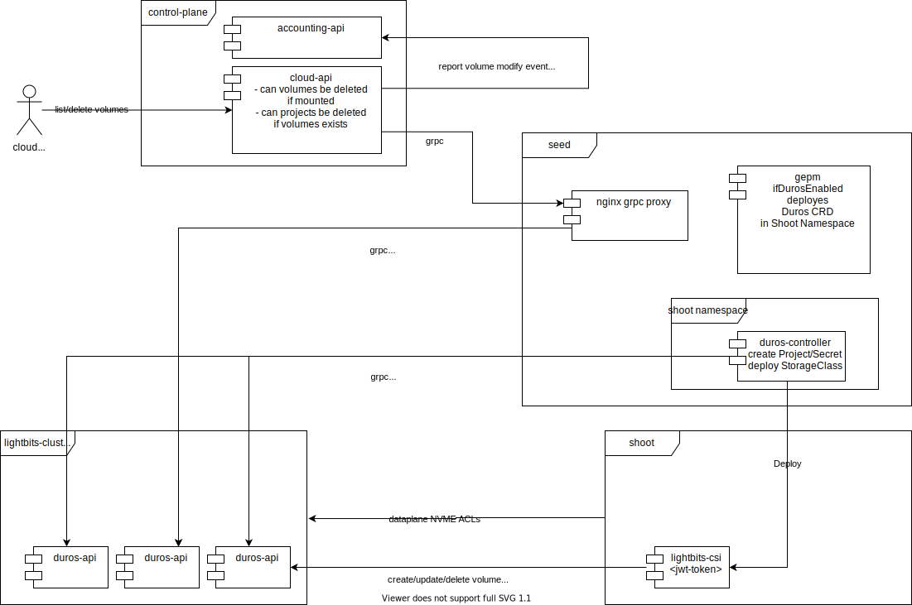

# duros-controller

A Bridge between cloud-native and duros storage controller. This controller is responsible to create a project in the dorus-api and an authentication token to access the duros storage.
After the authentication token is created, it creates a storage class deployment in the shoot which itself authenticates against the duros storage to create/delete PV and mount them.

## Architecture

## Configuration

The configuration is done through a CustomResource in the shoot namespace in the seed. The LightBitsStorage CustomResource contains a Reference to the metal-api project and the URLs and the Admin Token of the duros-api.
The Gardener Extension Provider Metal will create a LightBitsStorage CustomResource on shoot creation.

## Use Cases

There are several use cases during the lifecycle of storage consumed by customers.

### First usage from a tenants project

There was no storage usage from a project before, e.g. because the customer created a new project and then a cluster is created.
Then `gepm` will create the `duros` CR and deploys the `duros-controller` into the shoot namespace in the seed.
The `duros-controller` will check if there is already a project present in the duros-api with the metal-api project ID and create it does not exist.
A JWT Token with project permission is created and stored as secret in the shoot namespace, the secretref is stored in `lbs.spec`.
With this a `StorageClass` deployment in the shoot is created.
A `ClusterwideNetworkpolicy` which allows the cluster to access the storage nodes is also deployed.
The Cluster user is able to create PVs.

### Second cluster in the same project

If a second cluster in the same project in the same partition is created, the `duros-controller` will see there is already a project present in the duros-api.
A new secret for this cluster is created and stored in the `lbs.status`.

### Clusters are deleted

If a cluster, even if the latest in the project, storage volumes are not deleted. This enables customers to keep their storage and consume it in new clusters.

### Storage Volume and Project list/delete

The cloud-api will add endpoints to list/delete duros volumes and list projects, this will be done through a grpc proxy as shown in the architecture.
A Duros project will be deleted if the metal-api project is deleted. A check if there are no volumes present is also implemented.

## Accounting

Accounting of volumes is done with the kube-counter running in every shoot in the seed. Accounting of volumes currently not in use in any of the clusters
are listed from the cloud-api and reported to the accounting-api.

## TODO

- check if Gardener deletes PVC's after cluster deletion.

## JWT Token specification

There are the 4 that are predefined and always present, 2 for the LightOS cluster owners (that's metal-stack in this case): system:custer-admin, system-viewer, and 2 for the tenants: default:admin (for the ever-present default project) and default:viewer (ditto). the roles correspond to the 4 role definitions i've sent you as a file roles-examples.tar.gz in this channel on 13 October at 15:15 (the permissions themselves have been extended a bit to cover the newly added API operations, and such).
the latter two tenant-specific roles will be auto-created for each project in the system when the project is created (and removed correspondingly), so for project customer-a there will be roles customer-a:admin and customer-a:viewer, and so on. these two roles will be similar to the default:admin and default:viewer roles in all respects but one: project-specific roles only grant permissions to access project-scoped stuff within the same project, so that default:admin will not be able to delete volumes from the project customer-a and and customer-a:viewer will not be able to GET a volume from the default project.
so, on a system right after the installation you'll have 4 roles total (2 system, 2 for default project), after 1 project being created you'll have 6 roles (the same plus 2 for the new project), after a total of 10 customer-specific projects were created you'll have 24 (2 system, 2 default plus 2*10 for tenants). the roles are to be mentioned in the roles claim of the JWTs in the form of <project-name>:<role-name> (except, as a reminder, it's a list, not a scalar, though possibly a list with just a singular entry).

The way the 4 roles are currently defined, your customers get just 2 roles, one of them (the viewer) useful for monitoring only, but the other one is "all powerful". assuming your customers have just one person who will hold the private key and sign JWTs for their entire org - that's fine. but once delegation comes into the picture, things get a bit more murky and they can end up in a "takeover" scenario - if the admin uploads another pub key into their project, supplied by a different employee, now that employee can immediately delete the original admin's pub key, thus rendering all the JWTs signed by the original admin useless (which is a good thing in case of officially sanctioned revocation, but a less desirable one in case of a hostile takeover by a rogue employee).
a way around that would be to introduce another per-project role, say <project-name>:user that would be very much like the admin, and would be able to do all the things except for one - manage the project credentials. this would keep the power of uploading and deleting credentials (the latter effectively also revoking all the JWTs signed by that credential, on the spot) in the hands of the original owner of the private key that corresponds to the pub key you deploy into each project upon creation - presumably your customer's admin/IT person's key.
a similar argument might be made for the system-wide cluster admins, if you expect using multiple credentials to sign FI-TS administrative JWTs and are concerned about some of them coming from rogue employees - the same logic applies, and can be resolved by one additional system scope role.
do consider this and we can follow up today after the demo at 3pm.